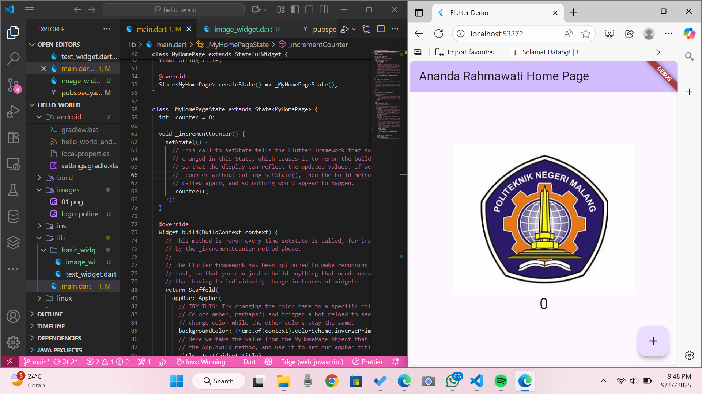

# hello_world
A new Flutter project.

# Praktikum Mobile Project Hello World

**NIM:** 2341720048
**Nama:** Ananda Rahmawati

## Praktikum 4

### Langkah 1 Text Widget

### Langkah 2 Image Widget

## Praktikum 5

### Langkah 1 Cupertino Button dan Loading Bar

### Langkah 2 Floating Action Button (FAB)

### Langkah 3 Scaffold Widget

### Langkah 4 Dialog Widget

### Langkah 5 Input dan Selection Widget

### Langkah 6 Date and Time Pickers

## Tampilan Pada Mobile 
